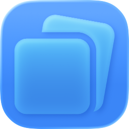

<p align="center">
  
  <br>
  <h1 align="center">CopyStack</h1>
  <p>Copy several things, then choose what to paste.</p>
  <p>CopyStack is a lightweight macOS menu bar app that remembers what you copy text, links, colors, images, and files in a fast, private stack that never leaves your Mac. Press ⌘⇧V from anywhere to pull it up, search or filter what you need, and paste exactly the one you meant.</p>
</p>

> <i>Stay tuned for more updates & features!</i>

## Installation

**1. Install via Terminal**  
Open your terminal and run the following command to download and install CopyStack:

```bash
brew install --cask sharky-3/copystack/copystack
```

**2. Allow the application in System Settings**  
Because CopyStack is installed outside the Mac App Store, macOS requires you to approve it before opening it for the first time. 
* Open **System Settings** > **Privacy & Security**.
* Scroll down to the Security section and click **Allow Anyway** next to the CopyStack notification.

**3. Launch the app**  
Once you have granted permission, open Spotlight Search (`Cmd + Space`), type **CopyStack**, and hit Return to run the application.

## Updating

When a new version of CopyStack is released, you can easily apply future updates by running this single command in your terminal:

```bash
brew upgrade --cask copystack
```
